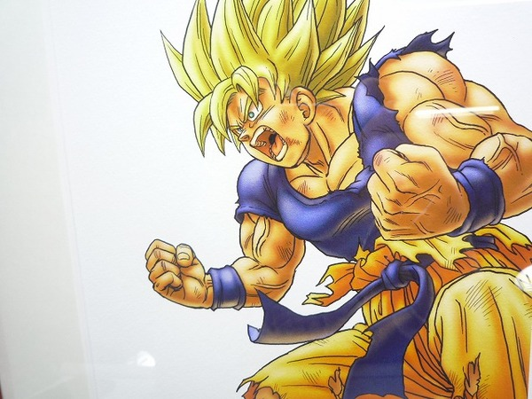
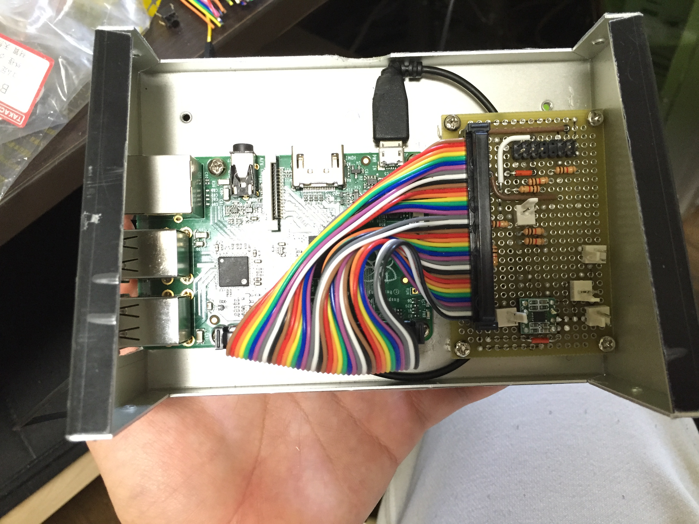

footer:【学生向け】もう一歩向上させるWebデザイン 2016/04/17 - Takayoshi Sawada ( @sawada_tkys ) / Topotal.com ( @topotal )
slidenumbers: true
autoscale: true

# 誕生日駆動開発のすゝめ 🎂

### __Takayoshi Sawada__ @sawada_tkys sawa-zen.com

---

# 自己紹介

__澤田 嵩善/sawa-zen__
@sawada_tkys

__役職__
フロントエンドエンジニア/
インタラクションデザイナー

__経歴__

- 名古屋市立大学 芸術工学部 　デザイン情報学科
- 株式会社 インタレストマーケティング
- 株式会社 ICS

---

## クリエイティブな事してますか？

---

## __モチベーション保ててますか？__

---

## なぜモチベーションが続かないのか。

- 具体的なアイデアが無く目的も無い。
- ゴールが無くだらだらと製作が続いてしまう。
- 細かい部分にこだわりすぎて進捗が出ない。
- 知識のインプットに時間がかかりすぎてしまう。
- 何のために作っているのか分からなくなる。

---

## __どうしたら モチベーションを保てるの？__

---

# モチベーションを保つには？

- ターゲットを明確にする
- デッドラインを設ける
- 目的を明確にする
- 成果物に対してのリアクションをもらう
- 自分への報酬を用意する
　

---

# モチベーションを保つには？

- ターゲットを明確にする
- デッドラインを設ける
- 目的を明確にする
- 成果物に対してのリアクションをもらう
- 自分への報酬を用意する

__　　=> そんなこと言われても。。。__

---

# __なんか良い道具出して！__

---

## __誕生日駆動開発があるじゃない__

---

# __誕生日駆動開発とは__

BDD: birthday driven development

__他人の誕生日をマイルストーンとし、サービスを製作していく開発スタイルの事。__

---

## メリット１ __ターゲットが確定する__

---

## メリット２ __デッドラインが誕生日で確定する__

---

## メリット３ __目的が決まりやすい__

---

## メリット４ __リアクションが確実に返ってくる__

---

# 事例紹介

---

# Best Rice (β版)

ターゲット：__@nari_ex__
開発期間：__約6日__
目的：__土鍋炊飯の記録を取れるようにし、炊飯技術の向上を図る__
制作物：iOS アプリ

---

ローンチに向けて Ver.1.0.0 鋭意開発中!

---

# よしかわあらーむ

ターゲット：__@rrreeeyyy__
開発期間：__約60日__
目的：__朝起きられない彼を、必ず朝起きられるようにする__
制作物：__目覚まし時計, iOS/Android アプリ__

---

目覚まし本体

---

中身

---

初めての電子工作

---

# やってみた感想

- とにかく__疲れた__
- 大きな__達成感__を感じられた
- __実際に使ってくれる__ので嬉しかった
- 「__これローンチできるのでは？__」という気になる

---

# まとめ

誕生日駆動開発はいいこといっぱい

- __ターゲットが確定する__
- __デッドラインが誕生日で確定する__
- __目的が決まりやすい__
- __リアクションが確実に返ってくる__

  __=> 完成までモチベーションが続く！最高！🎂__

