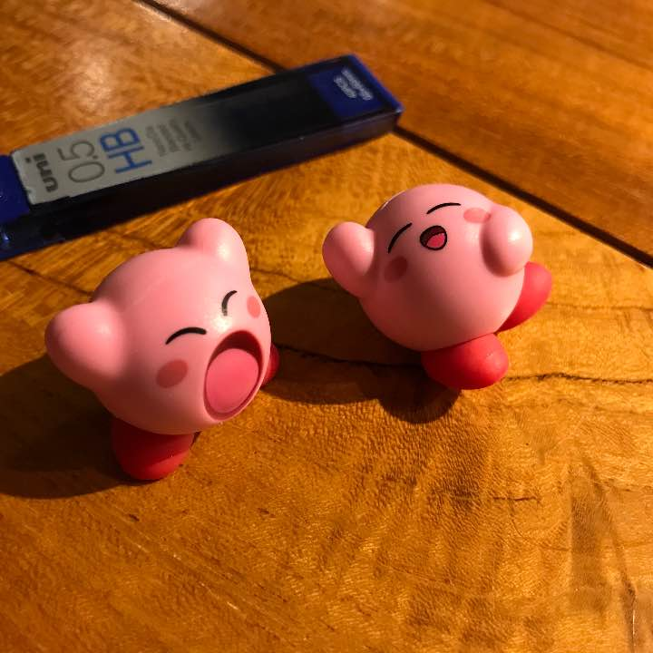

autoscale: true

# **mercariを使ってみた**

---

# ユーザーの特徴

- 性別：男性
- 年齢：26歳
- 職業：エンジニア
- メルカリ歴：半年
- 主なメルカリの用途：購入よりどちらこというと断捨離
(あまり購買欲求が無い)

---

# **まずは初出品してみる**

---

# 出品した物

- **カービィのフィギュア二点**
- 出品額：300円
- カテゴリー：
    エンタメ・ホビー>
    フィギュア>
    ゲームキャラクター
- 配送方法：らくらくメルカリ便
- 発送日の目安：4〜7日

---

# なぜフィギュアにしたのか？

- 小さくて梱包が楽そうだったから
- 欲しかったポーズではなかったから
- 衝動買いしたけれど置く場所に困ったから
- かばんに入っていたから

---

# なぜフィギュアにしたのか？

- 小さくて梱包が楽そうだったから
- 欲しかったポーズではなかったから
- 衝動買いしたけれど置く場所に困ったから
- **かばんに入っていたから**

---

# **かばんに入っていたから？**

---

# 出品時の状況を振り返ってみる

- 場所：池尻大橋のスターバックス
- 時間：22時〜23時

  **=>とりあえず出品してみようと思い立ったが、家にいたわけでは無く帰ってからでは眠い。。。**

---

# 良かった事

---

# 悪かった事
