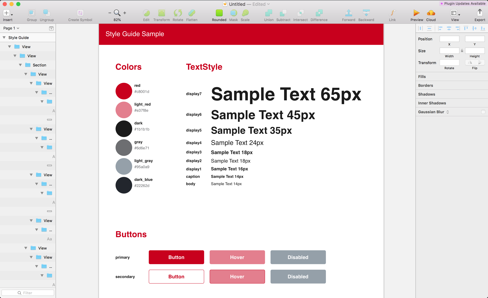

footer: @sawa-zen (2018/4/22) Roppongi.js
slidenumbers: true


# React Sketch.appで<br>デザインガイドラインを作ってみた

---


# @sawa-zen

所属：株式会社メルペイ
役職：フロントエンドエンジニア/インタラクションデザイナー

Three.js
React
SketchApp
Blender
YouTuber大好き


---


# React Sketch.appって知ってる？


---


# React Sketch.appとは

- ReactでSketchデザインを扱えるツール
- airbnb社のOSS
- Sketchプラグインを書き出せる
- 記法はほぼReactNativeと同じ

---


```javascript
import React from 'react';
import { View, Text, render } from 'react-sketchapp';

export default function(context) {
  render(
    <View>
      <Text>Sample Text</Text>
    </View>,
    context.document.currentPage()
  );
}
```

---


# React Sketch.appはいい事だらけ!!

- コードなのでバージョン管理できて最高 :+1:
- デザイン修正もコードレビューできて最高 :+1:
- エンジニアでもデザイン修正できて最高 :+1:


---


# React Sketch.appはいい事だらけ!!

- コードなのでバージョン管理できて最高 :+1:
- デザイン修正もコードレビューできて最高 :+1:
- エンジニアでもデザイン修正できて最高 :+1:

# **全部これで書けばいいのに** :innocent:

---


# ほんとに？

---


# React Sketch.appはそんな甘くない!!

- デザイナーもJSを覚える必要がある :-1:
- デザインとクライアントの二度手間実装 :-1:
- 直感的にデザインできない :-1:

---


# 全てReactはしんどい...<br>:innocent: :innocent: :innocent:

---


## デザインガイドラインだけなら...？

---



---


# **Reactで書いてみました** :muscle:

---


# Reactでガイドラインを<br>作ってみて良かったこと

---

# ① スタイルがコードとして共有できる :ok_woman:

nodeモジュールとして共有すればスタイルをコードして扱える

- color
- font-size, font-weight
- margin, padding
- etc...

---


# ② プラグインとして共有できる :ok_woman:

プラグインを実行するだけで以下２つがセットで生成できるため、プロジェクトを跨いだデザインの統一化を図りやすい。

- スタイルガイドライン
- シンボル

---


# ③ 単純作業が多いので向いている :ok_woman:

繰り返しViewを並べる作業が多いのでコードで表現する方が速い


---


# ④ 無駄なシンボルが残らない :ok_woman:

効率化の為に作成していたシンボルがコードに置換できる


---


# 課題

- コンポーネントの細かなデザインからはエンジニアでは難しい
- デザイナーさんと密なコミュニケーションが必須
- 結局JSをデザイナーさんも触る可能性がある
- そもそも作ってる余裕が無い事が多い

---


# でも手応えはあった :+1:

---


# もっとプロダクトのUIを<br>良くしていきたい！

---


# 実業務に導入するためには？

---


# [fit] **UIの信頼性向上を担う<br>新部署の爆誕しかない！**

---


# ~~Site Reliability Engineering（SRE）~~

# ↓

# [fit] **UI Reliability Engineering<br>（URE）**

---


# [fit] **弊社に新部署設立検討<br>お願いします！**<br> :bow: :bow:
