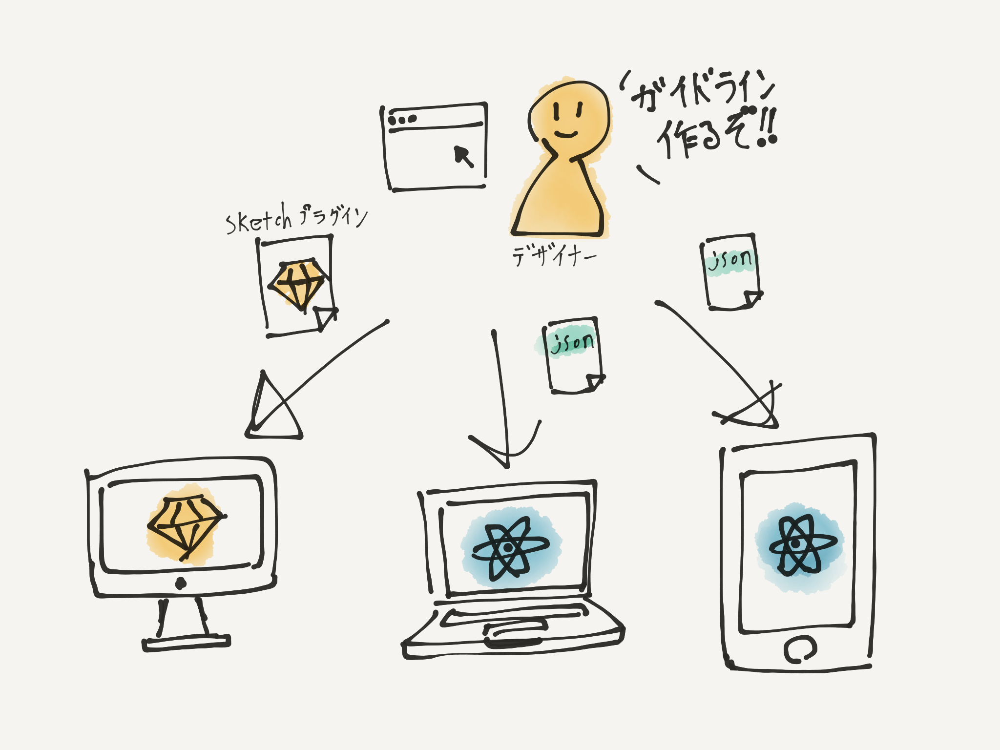

footer: @sawa-zen (2018/6/22) react-native-meetup

## **デザインガイドラインを作る Webサービスを作っている話**

#### Merpay, Inc フロントエンドエンジニア @sawa-zen

---

# [fit] @sawa-zen

所属：Merpay, Inc
職種：フロントエンドエンジニア/インタラクションデザイナー

Three.js
React
SketchApp
Blender
YouTuber大好き

---

## **react-primitivesって 知ってますか？**

---

## react-primitivesとは？

  - プラットフォーム毎のAPIに左右されず共通で使用できるインターフェース
  - **以下のrenderに対して同じコードでViewが作れる**
    - **react-dom**
    - **react-native**
    - **react-sketchapp**

---

## 機能
  - View: レイアウトのためのコンポーネント
  - Text: テキストのためのコンポーネント
  - Image: 画像のためのコンポーネント
  - Touchable: インタラクションのためのコンポーネント
  - StyleSheet: ReactNative の StyleSheet と同じ
  - Animated: Viewにアニメーションを追加するためのコンポーネント

---

## 想定しうる実用例

### **デザイン段階でコードでUIを作成し コンポーネントをエンジニアに共有する**

---

---

## やってみた!!

---

---

---

# 感想

- 複雑なViewの場合若干の見た目の差異が気になる
- デザイナーさんにこのコード書かせるのは酷
- 型定義ファイルが無くて不安

---

# 感想

- 複雑なViewの場合若干の見た目の差異が気になる
- デザイナーさんにこのコード書かせるのは酷
- 型定義ファイルが無くて不安

  **=> C向けのプロダクトには実用的ではない**

---

## 他に用途は無いものか 🤔

---

# どういう用途であれば使えそうか？

- 複雑なViewを必要としない
- 堅牢さを必要としない
- デザイナーさんがコードを書く必要がない

---

# 業務効率化ツールであればいけるのでは? 🤔

---

## ここからが本題

---

# こんな物を作り始めました

**スタイルガイドラインをWeb上で作成できるツール**

- SketchのプラグインとしてViewを書き出せる
- ガイドラインに関わる情報をjsonで書き出せる
  - カラー
  - テキストスタイル
  - etc...

---

---

# DEMO

---

# 何が良いのか

- デザイナーがGUI操作で扱える
- jsonとして値がもらえる
  - Viewライブラリに制限されない
  - JSでなくても扱える

---

# 何が良いのか

- デザイナーがGUI操作で扱える
- jsonとして値がもらえる
  - Viewライブラリに制限されない
  - JSでなくても扱える

  **=> react-primitivesが無駄にならない！**

---

# 今後の展望

- 各編集機能
- font-famiryパターン
- marginパターン
- border-radiusパターン
- jsonのimport機能

